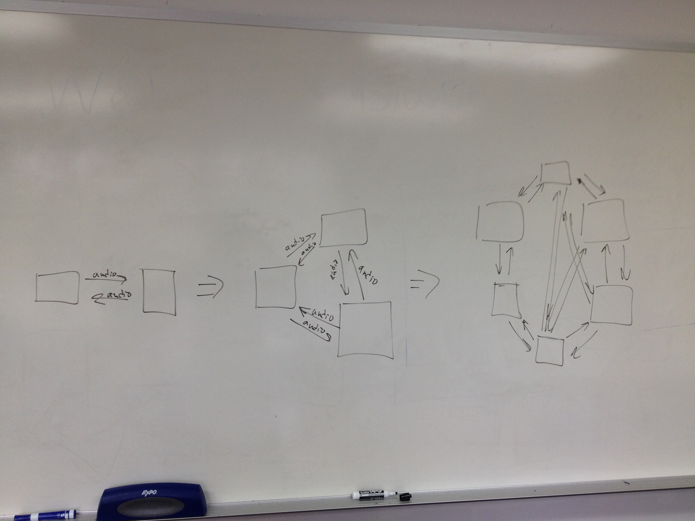
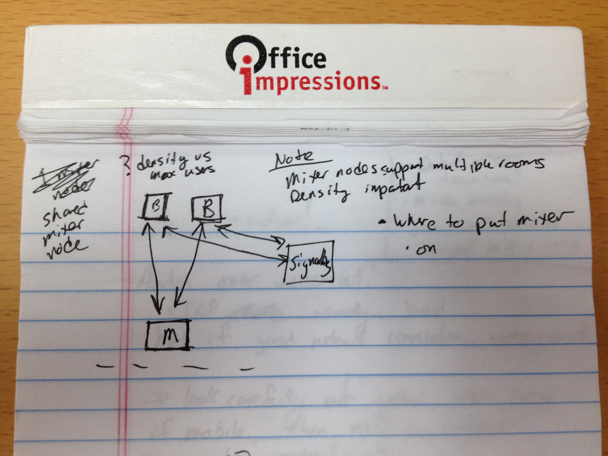
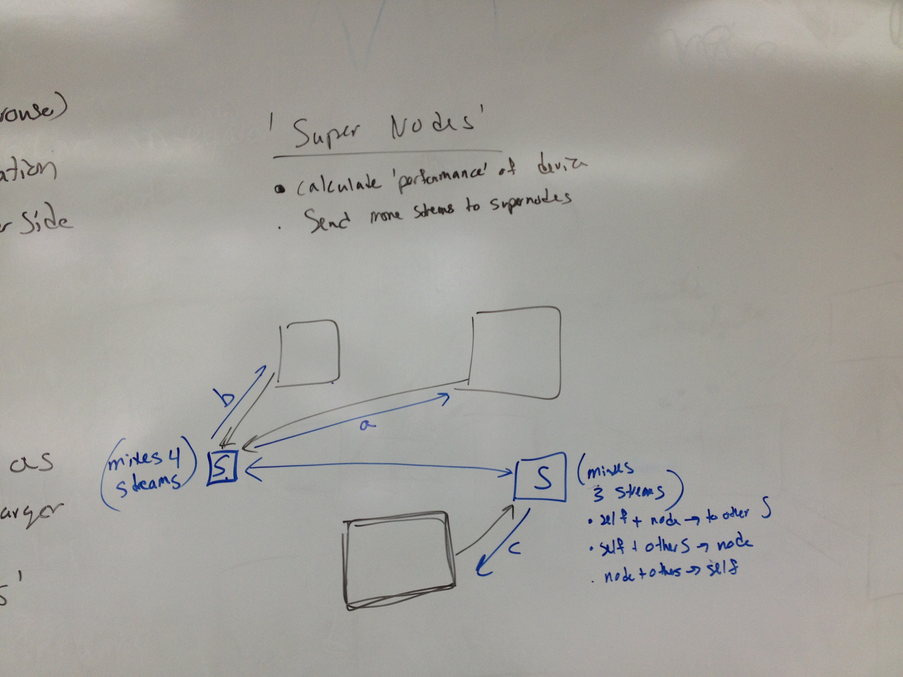
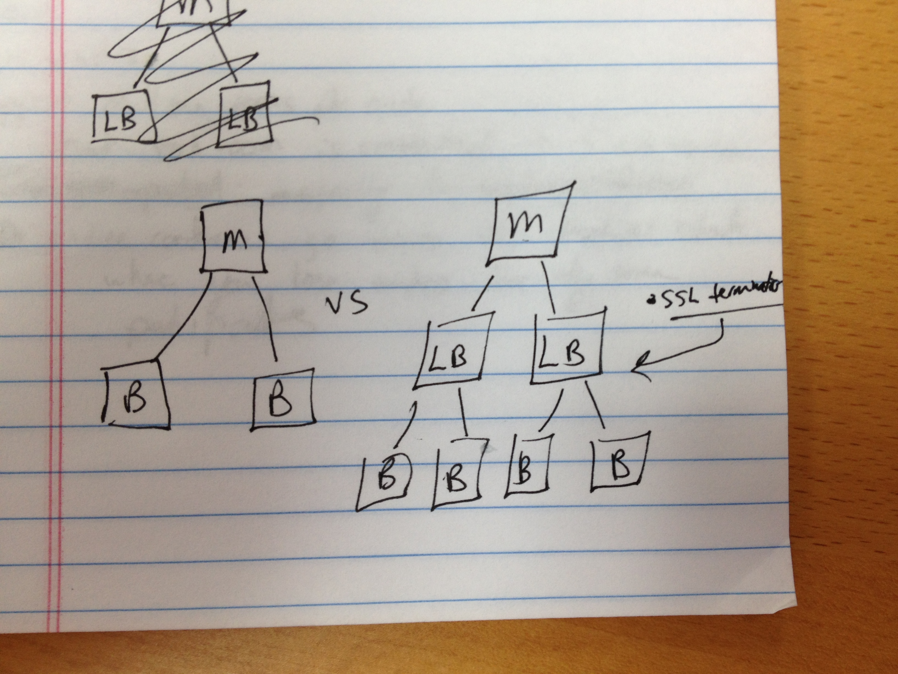
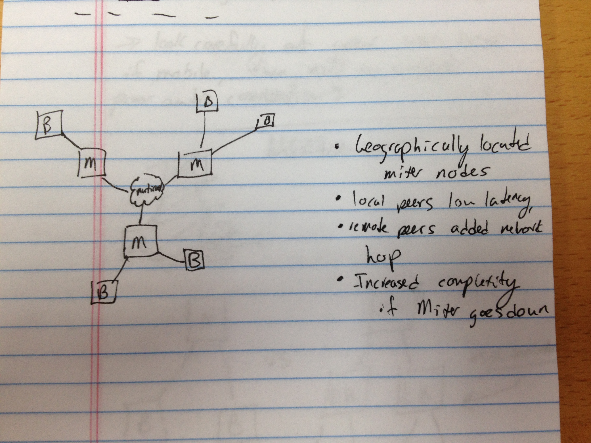
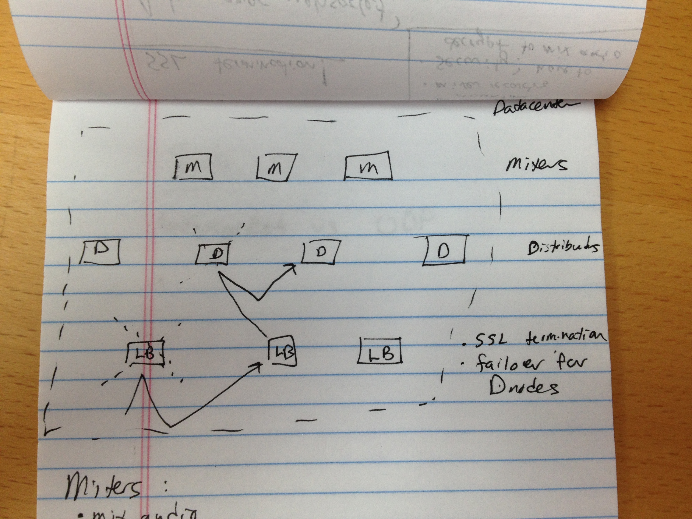

Outline
--------

* Welcome Slide

* Overview of problem
  * Mesh P2P is great for <4-6 people
  * Show comparison of platform max-user count
  * Audio mixing (CPU) & Transmission (Bandwidth)
  * Collaboration vs. Broadcast modes


* Solution: Mixer ('Media Control Unit' - ugh...)
  * Mixer nodes support multiple rooms per node
    * Decision: Each room contained in a single node
      * This way if conference goes down, everyone is disconnected
        rather than a partial disconnect with 'hanging' users
  * Density important (What's the density vs max users?)
  * Where do you put the mixer w/ multiple datacenters?
   * Consider: datacenter loading, expected conference size,
     user locations
   * Naive: random
   * Naive: nearest to first user



* Brief lesson on audio mixing
 * P2P, just need to mix all audio recieved
 * Centralized mixing, need to send unique stream to each user
   * i.e. Everything else minus that user
   * Can reduce laod by not mixing people who aren't talking
 * Security: Have to decrypt to mix audio
  * Means no-longer end-to-end encryption
  * If that's an issue, then deploy inside corporate network/firewalls

* Peer2Peer 'Super Nodes'
 * Skype used to use p2p for 'user online' detection
 * Utilized 'heavy' clients to offload work from mobile clients
 * Complexity & quality control more difficult if outside your network


* Offloading work from Mixer
 

* TCP vs UDP
 * Websocket vs UDP
 * TCP typically bad for low-latency RTC if poor network
 * But if connection good, works awesome (Wifi can be troublesome w/ burstyness)
 * Look closely at your user base --> if mobile, then need to support
   poor audio connections

* Geographically located mixer nodes
 * Mixer nodes
 * 'Nearby' clients low latency
 * 'Far' clients added network hop
 * Increased complexity (esp if mixer goes down)


* Fault Tolerence
  * Detect mixer downtime


* Dynamic scaling based on loading
 * Cloud is dynamic, so add/remove mixing nodes to handle daily changes in usage

* Collaboration & Broadcast Hybrid
 * e.g. podcasts, concerts, company-wide presentations
 * Relay nodes multiply content

* Additional features easily added:
 * Broadcast
 * Call recording & archival
 * Transcription
 * Event/Sound injection


Move the voice folder into the reveal.js plugin folder such that it looks like: `revealjs/plugin/voice/voice.js`, and include the following in the presentation HTML:

```javascript
Reveal.initialize({
  // speakit.io config
  // @param voiceRoom - Name of the room
  // @param voiceAPIKey - API Key needed to create a room (not needed to join a room)
  voiceRoom: 'revealjs',
  voiceAPIKey: '',

  // Optional libraries used to extend on reveal.js
  dependencies: [
    { src: 'plugin/voice/voice.js', async: true, condition: function() { return !!document.body.classList; } }
  ]
});
```
